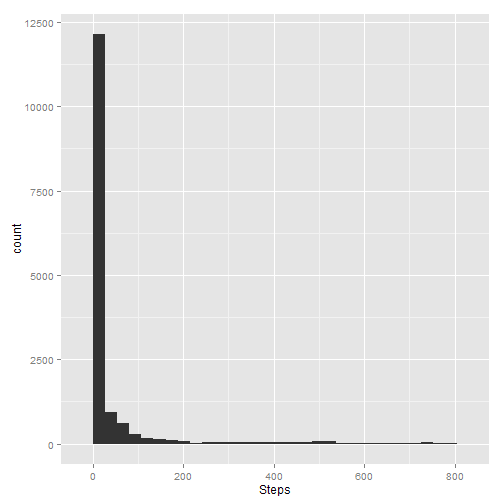
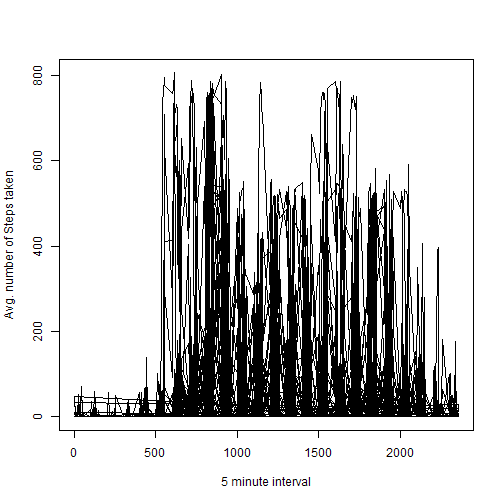
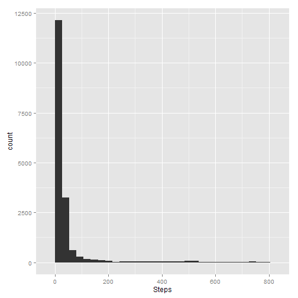

# Reproducible Research: Peer Assessment 1


## Loading and preprocessing the data

```r
x = read.csv("activity.csv")
```


## What is mean total number of steps taken per day?


```r
library(ggplot2)
qplot(x$steps[!is.na(x$steps)], xlab = "Steps")
```

```
## stat_bin: binwidth defaulted to range/30. Use 'binwidth = x' to adjust this.
```

 

```r
average = mean(x$steps[!is.na(x$steps)])
print(average)
```

```
## [1] 37.38
```

```r
med = median(x$steps[!is.na(x$steps)])
print(med)
```

```
## [1] 0
```

## What is the average daily activity pattern?

```r
plot(x$interval,x$steps, type = "l", ylab = "Avg. number of Steps taken", xlab = "5 minute interval")
```

 


## Imputing missing values

```r
numna = length(x$steps[is.na(x$steps)])
A = which(is.na(x$steps))
for(a in x$steps[A]) {
     x$steps[A] = average }
qplot(x$steps, xlab = "Steps")
```

```
## stat_bin: binwidth defaulted to range/30. Use 'binwidth = x' to adjust this.
```

 

```r
average = mean(x$steps)
print(average)
```

```
## [1] 37.38
```

```r
med = median(x$steps)
print(med)
```

```
## [1] 0
```


## Are there differences in activity patterns between weekdays and weekends?

